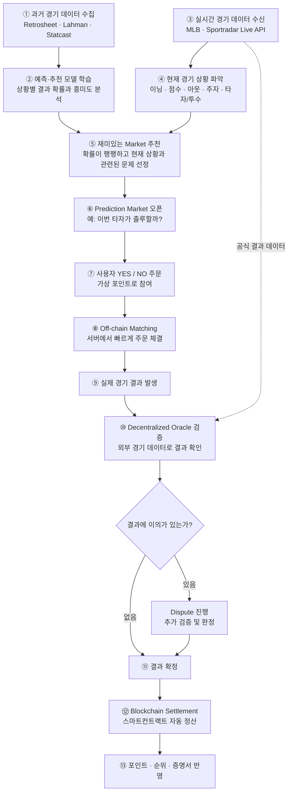

# 프로젝트 개요

#### 실시간 야구 경기 데이터 기반 예측 시장과 블록체인의 검증·정산을 결합한 구장 내 Prediction Market 플랫폼

실시간 스포츠 데이터와 관중의 참여 이력을 분석해 빅데이터 기반으로 개인 맞춤형 예측 시장을 추천하고, 관중들이 가상 포인트로 참여한 결과를 Oracle과 스마트컨트랙트로 투명하게 검증·정산하는 경기장 기반 Prediction Market 플랫폼.

<aside>

### Block Chain 활용

**off-chain**: 실시간 UX가 필요한 부분
**on-chain**: `사용자의 주문 서명`, `포지션 소유`, `거래/정산 기록`, `시장 결과 확정` , `자산 또는 포인트 settlement` 등 신뢰가 중요한 부분

</aside>

---

### API 조사

`MLB Game Play-by-Play` : 실시간 MLB 경기의 **투구, 타석, 득점, 주자 상황 등 플레이 단위 데이터를 제공하는 API**.

[Game Play-by-Play](https://developer.sportradar.com/baseball/reference/mlb-play-by-play)

---

### Data 조사

`Retrosheet` : 
과거 MLB 경기의 **Play-by-Play 및 경기 결과 데이터를 제공하는 야구 데이터셋**.

[Retrosheet](https://www.retrosheet.org/)

`Lahman Baseball Database` : 선수와 팀의 **시즌별 타격·투구·수비 등 장기 기록을 제공하는 데이터셋**.

[Lahman Baseball Database](https://sabr.org/lahman-database/)

`Baseball Savant` : Statcast 기반의 **투구 속도, 타구 속도, 발사각 등 세부 경기·선수 데이터를 제공하는 MLB 데이터 플랫폼**.

[Baseball Savant: Statcast, Trending MLB Players and Visualizations](https://baseballsavant.mlb.com/)

---

### 서비스 구체화

<aside>

#### 유저 플로우

1. 과거 경기 데이터 수집 (Retrosheet / Lahman / Statcast)
↓
2. 경기 상황별 확률 분석 (예측·추천 모델 학습)
↓
3. 실시간 경기 데이터 수신 (MLB / Sportradar API)
↓
4. 현재 경기 상황 파악 (이닝, 점수, 아웃카운트, 주자, 타자·투수 정보)
↓
5. 예측 문제 추천 (결과 확률이 한쪽으로 치우치지 않은 Market 선정)
↓
6. Prediction Market 오픈 (예: “이번 타자가 출루할까?”)
↓
7. 사용자가 YES / NO 주문 제출 (가상 포인트로 원하는 결과에 참여)
↓
8. Off-chain 주문 체결 (서버에서 빠르게 주문을 매칭하고 가격 계산)
↓
9. 실제 경기 결과 확인 (Oracle이 여러 경기 데이터 소스를 통해 결과 검증)
↓
10. 결과 확정 또는 이의 제기 (결과가 명확하면 확정하고, 문제가 있으면 Dispute 진행)
↓
11. 블록체인 자동 정산 (확정된 결과에 따라 스마트컨트랙트가 포인트와 기록 정산)

#### 그림으로 보기

</aside>

### 법적 대응 방안

<aside>

### 「국민체육진흥법」 제26조의 **유사행위 금지 규정에 저촉**

스포츠 경기 결과를 예측하게 하고, **적중자에게 재물이나 재산상 이익을 제공하는 행위**를 금지.

→ 모든 사용자에게 동일한 무료 가상 포인트만 지급.
→ 포인트는 **구매·환전·양도·상품 교환이 불가능** 하도록 설계.
→ 예측 결과에 따른 금전·실물 보상을 제공하지 않아, 법에서 문제 삼는 **재산상 이익 제공 요소를 제거**.

→ 단, 순위에 따른 물품 경품은 아직 위험요소가 있음

</aside>

<aside>

### 「사행행위 등 규제 및 처벌 특례법」제2조에 저촉 가능성 있음

**여러 사람의 재물이나 재산상 이익을 모아** 우연한 결과로 **참가자 간 이익과 손실을 결정**하는 영업을 금지

→ 모든 사용자가 돈을 내지 않고 무료 포인트만 이용하게 함
→ **승자의 보상이 패자의 재산상 손실에서 나오는 구조**로 만들지 않게 하면 저촉되지 않음. (참가자에게 실제 재산상 손익X)

</aside>

<aside>

### 형법 **제246조(도박, 상습도박)**

대법원은 도박을 기본적으로 재물을 걸고 우연한 결과에 따라 재물의 득실을 결정하는 행위로 봄

→ 사용자는 자기 돈이나 재산을 넣지 않고 무료 지급된 1,000P만 사용함
→ 포인트는 현금·USDC·상품권 등으로 바꿀 수 없고 사용자 간 거래도 불가능하게 함

</aside>

<aside>

### 형법 **제247조(도박장소 등 개설)**

영리 목적으로 도박 공간을 개설하는 행위

→ 참가비·수수료·베팅액·현금 환급을 받지 않는 **무료 fan-engagement game**으로 설계 됨

</aside>

<aside>

### 추가적인 어필 포인트

1. 구장에서만 허락하여 “팬의 흥미”를 돋구는데 사용 (온라인 도박 X)
2. 입장 시 포인트를 지급하여 “돈을 거는 도박”이 아님
3. 얻은 포인트를 외부 체인과 분리하여 환전 및 이전이 불가능하게 설계됨
4. 또한 MVP는 MLB 경기만 포함되기 때문에 비교적 
</aside>

---

---

- **시연**: SSAFY 공간을 경기장처럼 설정해 GPS + NFC 입장을 시연하고, 실제 MLB 경기 기반으로 서비스 동작을 보여줌.
- **위치 인증**: 별도 구장 API 없이 좌표 + 반경 + NFC로 처리.
- **MLB 선택 이유**: KBO는 실시간 상세 데이터 확보가 어렵고, MLB는 Sportradar 등 검증 가능한 API 활용 가능.

아예 이걸로 도박 사이트 취업이나 준비할까요

일단 돈은 많이 줄것 같은데

잡히면 중국인이라고 하면 그냥 보내줄듯 <<< 그럴 필요가 있을까? 우리한텐 준유가 있어. 보내! 줄껀 줘!

ㄴ 준유 좋다

ㄴ 준유님 기억할게!!

ㄴ 이게 팀장이구나…

ㄴ 아낌없이 주는 준유

좋다~!! 돈 땡기고 파이어족 하죠? 진짜 불탈수도 있다는거임,,,

이제 뭐냐…. 퇴직을 못 할 것 같긴 한데? 뭐…. 퇴직하면 이제….. 조폭한테 쫓기는 거 아닙니까? - 정년퇴직 계속 연장해달라고 시위도 하는데 오히려 좋죠

경력 “도박 사이트 제작 경험 있음”

이제 도박 사이트 → 도박 사이트 이직밖에 못 하죠

ㄴ 전세계적으로 가장 돈을 많이 버는 산업인데

ㄴ 국적만 버리면 기회는 많아집니다

ㄴ 영어는 여기서도 공부해야하는구나…!

난… 여러분들을 위해 경찰에 진술할 자신이 되어있어요 ㅋㅋㅋㅋㅋㅋ

혼자 빠져나가????

나갈 수 있는 사람은 나가야죠!!!! 보내줘!!!! 팀장님만 잡고 난 보내줘!!!

그거 아시죠 영화에서도 첫 5분에 죽는 캐릭터

ㄴ 항상 경찰한테 뭘 말하려다 죽긴해요

ㄴ ㅇㅈ 난…난 돌아가겠어… (첫 번째로 죽음)

ㄴ 적어도 의리 지키면 영화 후반부에 죽음

ㄴ 결국 죽잖아요 ㅋㅋㅋ죽는거잖아ㄱㄴ ㄱ

ㄴ 원래 인간은 죽어….빠르냐 늦느냐지…. < ㅇㅈ

다들 힘든가보다.. 여기까지 하죠

취직준비 완료

고생하셨습니다!
이건 준유님 보라고 남겨두죠

~~준유님이라고 해야 내가 쓴줄 모름 <<< 이 말로 들키셨을 듯~~

팀장님 좋아하면 좋겠다ㅎㅎ <<< 이 사람이 범인이야 준유야!!